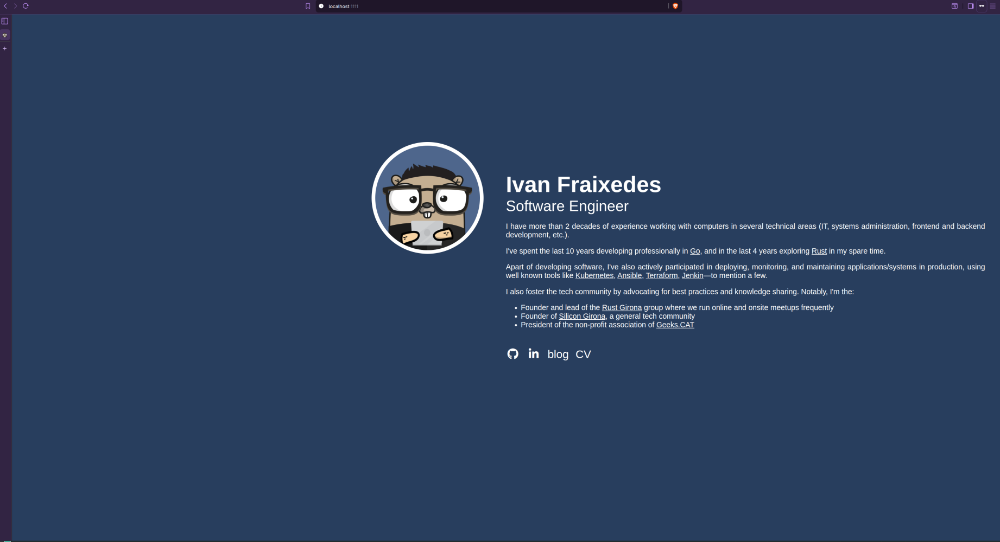

#  Kissi

A [Zola][zola] KISS theme to introduce yourself.

Based on [Zola Hallo theme][zola-hallo].



## Original

This is a modification of  the [Zola Hallo theme][zola-hallo].

## Installation

The easiest way to install this theme is to either copy the sources on _themes/kissi_ or a better
alternative is to use it as a submodule.

Enable the them in your `(zola|config).toml`

```toml
theme = "kissi"
```

And add the following configuration paremeters

```toml
base_ulr = "https://the-url-to-your-site.test"  # Required by Zola
compile_sass = true                             # Required by this theme
theme = "kissi"                                 # Use this theme
minify_html = true                              # Recommend to reduce size of the page
```

## How to add your content

Use the following variables in your `(zola|config).toml`, if you don't set those values are the
defaults.

```toml
[extra.kissi]
portrait = ""               # Optional path to image file. It only prints the HTML element when it's set and not empty.
fullname = "Your fullname"
tagline = "Your tagline"
links = []                  # Optional. The container element it's only printed

theme = {
    background = "#283E5E",         # Background color of the page
    foreground = "#FFFF",           # Color of the text
    hover = "#CCCC12",              # Color of the links when hovered
    portrait = {
        background = "#4E668C",     # Background color of the portrait. It's visible if the image has a transparent background
    },
}
```

There are two types of links:
* icon: A Font Awesome Brand icon without the `fa-` prefix
* text: A text

Example:

```toml
links = [
    { title = "github", url = "https://github.com/ifraixedes", icon = "github" },  # Link with icon (only the Font Awesome brands)
    { title = "my blog", url = "https://blog.fraixed.es", text = "blog" },         # Link with text
]

```

Your introductions goes in `content/_index.md`

## Important things to consider

Add a `favicon.ico` into the _static_ directory of your site.


[zola]: https://www.getzola.org
[zola-hallo]: https://codeberg.org/janbaudisch/zola-hallo
[fontawesome]: https://fontawesome.com
[fontawesome-brands]: https://fontawesome.com/icons?d=gallery&s=brands&m=free
[config]: https://codeberg.org/janbaudisch/zola-hallo/src/branch/main/config.toml
